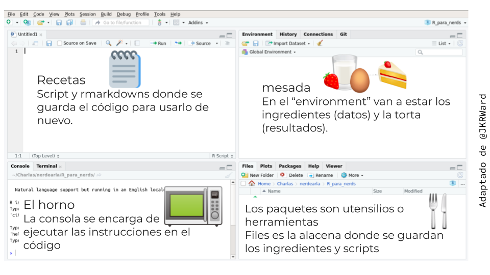

## ¿Por qué R?

Excel es un software admirable. Es genial para hacer data entry, para ver los datos crudos y para hacer gráficos rápidos. Si venís usándolo hace tiempo, seguro que aprendiste un montón de trucos para sacarle el jugo al máximo, habrás aprendido a usar fórmulas, tablas dinámicas, e incluso macros. Pero seguro que también sufriste sus limitaciones. 

En una hoja de Excel no hay un límite claro entre datos y análisis. Sobreescribir datos es un peligro muy real y análisis complicados son imposibles de entender, especialmente si abrís una hoja de cálculo armada por otra persona (que quizás es tu vos del pasado). Además, repetir el análisis en datos distintos o cambiando algún parámetro se puede volver muy engorroso. 

Si lo que necesitás son reportes frecuentes y automáticos, y análisis de datos con muchas partes móviles, estaría bueno poder escribir una receta paso a paso y que la computadora corra todo automáticamente cada vez que se lo pedís. Para poder hacer eso, ese paso a paso tiene que estar escrito en un lenguaje que la computadora pueda entender, ese lenguaje es R.

La forma en la que interactuás con la computadora con R es diametralmente distinta que con Excel. Esto lo hace extremadamente poderoso, pero el precio a pagar es básicamente el de tener que aprender un nuevo idioma. 

## Cómo decirle a R qué hacer

### Orientándose en RStudio

En principio se podría escribir código de R con el Bloc de Notas y luego ejecutarlo, pero nosotros vamos a usar RStudio, que brinda una interfaz gráfica con  un montón de herramientas extra para hacernos la vida maś fácil. 

Cuando abras RStudio te vas a encontrar con una ventana con cuatro paneles como esta:


Los dos paneles de la izquierda son las dos formas principales de interactuar con R. El panel de abajo a la izquierda es **la consola**. Es el lugar que te permite *conversar* con R. Podés escribir comandos que se van a ejecutar inmediátamente cuando apretes Enter y cuyo resultado se va a mostar en la consola. 

Por ejemplo, hacé click en la consola, escribí `2 + 2` y apretá Enter. Vas a ver algo como esto:

```{r}
2 + 2
```

Le dijiste a R que sume 2 y 2 y R te devolvió el resultado: 4 (no te preocupes del `[1]` por ahora). Eso está bueno si querés hacer una cuenta rápida o chequear algo pequeño, pero no sirve para hacer un análisis complejo y reproducible. 

En el panel de arriba a la izquierda tenemos esencialmente un editor de texto. Ahí es donde vas a escribir si querés guardar instrucciones para ejecutarlas en otro momento y donde vas a estar el 87% de tu tiempo usando R. 

A la derecha hay paneles más bien informativos y que tienen varias solapas que vamos a ir descubriendo a su tiempo. Para destacar, arriba a la derecha está el "environment", que es forma de ver qué es lo que está "pensando" R en este momento. Ahí vas a poder ver un listado de los datos que están abiertos y otros objetos que están cargados en la memoria de R. Ahora está vacío porque todavía no cargaste ni creaste ningún dato. Abajo a la derecha tienen un explorador de archivos rudimentario y también el panel de ayuda, que es donde vas a pasar el otro 13% del tiempo usando R.

Entonces, para resumir: 



### Hablando con R

Ya viste cómo usar R como una calculadora. 

```{r}
2 + 2
```

Si usaste fórmulas en Excel, esto es muy parecido a poner `=2+2` en una celda. R entiende un montón de operaciones aritméticas escritas como seguramente ya te imaginás:

 - `+`: sumar
 - `-`: restar
 - `*`: multiplicar
 - `/`: dividir
 - `^`: exponenciar

Pero además conoce muchas otras operaciones. Para decirle a R que calcule el seno de 1 hay que escribir esto:

```{r}
sin(1)
```
Esto es similar a poner `=SIN(1)` en Excel. La sintaxis básica para aplicar cualquier función es `nombre_funcion(argumentos)`.

::: {.alert .alert-success}
En Excel el nombre de las funciones dependen del idioma en el que está instalado. Si lo usás en español, la función seno es `SEN()`. En R, las funciones siempre se escriben igual (que coincide con el inglés).
:::


```{r}
?sin
```

Esto va a abrir el documento de ayuda para la función `sin()` que, como verás, tiene la documentación de las funciones trigonométricas que trae R por defecto. Todas las ayudas de R vienen divididas en secciones:

Description
: Una descripción breve de la función o funciones que se documentan. 


Usage
: Nombre de los argumentos de la función. La mayoría de las funciones trigonométricas tienen un solo argumento, que se llama `x`. La función `atan2()` tiene dos argumentos, llamados `x` e `y`.


Arguments
: Una descripción de cada argumento. En este caso `x` e `y` son vectores numéricos o complejos. Aunque todavía no sepas qué es un "vector", de esta descripción ya podés intuir que las funciones trigonométricas aceptan números complejos. 


Details
: Una descripción detallada de las funciones. Por ejemplo, detalla qué es lo que devuelve la función `atan2()`, describe las unidades en las que tienen que estar `x` e `y`, etc.. 


Value
: Describe qué tipo de valor devuelve la función.


Examples
: (abajo de todo) Es la sección más importante y probablemente la que vas a buscar primero cuando te encuentres con una función nueva que no sabés cómo usar. Acá vas a encontrar código de R de que ejemplifica el uso típico de la función. 


(Otras secciones)
: Pueden haber otras secciones que detallen distintas particularidades de la función, o referencias a los métodos implementados. 


R es un lenguaje creado por estadísticos y pensado para hacer estadística, así que también viene con funciones estadísticas. ¿Querés hacer un promedio? 


::: {.alert .alert-info}
### Desafío:

Abrí y leé la ayuda de la función `lm()`. 

¿Qué hace esa función? ¿Qué argumentos acepta?

En Excel el nombre de las funciones dependen del idioma en el que está instalado. Si lo usás en español, la función seno es `SEN()`. En R, las funciones siempre se escriben igual (que coincide con el inglés).
:::


es una descripción general de las funciones. En este caso describe que estas son "las funciones trigonométricas". La siguiene sección, **Usage**


- ¿Por qué R?
- Cómo funciona
  - Mapa para navegar RStudio. 
  - Definir variables. 
  - Ejecutar funciones.
  - Instalar paquetes. 
  - Acceder y entender la ayuda y documentación de funciones y paquetes.
  
  
  
  
- Manejo de proyectos con RStudio
  - Administrar una estructura de directorios.
  - Saber dónde está el working directory.
  
- Introducción a `{RMarkdown}`
  - Sintaxis básica de Markdown.
  - Unificar código, gráficos y prosa.

- Lectura de datos ordenados
  - Cargar tablas en memoria (csv y xlsx).
  - Identificar datos ordenados.
  - Diferenciar tablas “anchas” y “largas”.
  - Tipos de datos en R.
  - Dar formato a los distintos tipos de datos.