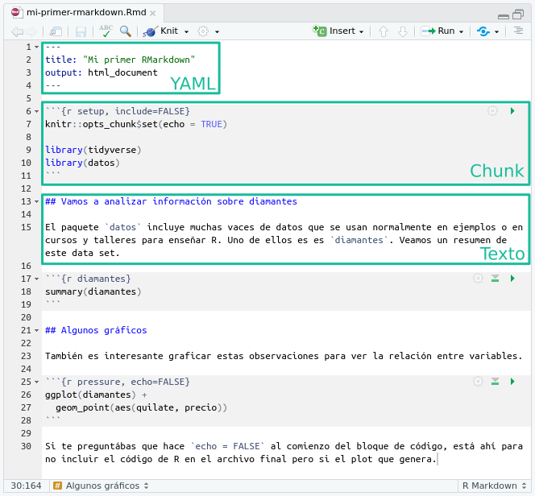

```{r setup, include=FALSE}
knitr::opts_chunk$set(echo = TRUE)
```

Durante este curso fuiste creando varios documentos con R Markdown en HTML. Este es un formato bastante gauchito que tiene un montón de flexibilidad, pero seguramente no es el único que necesitás. Casi seguro que los informes los tengas que presentar en formato PDF o, incluso, ¡en papel impreso! {rmarkdown}, y todo un amplio ecosistema de otros paquetes, permite generar documentos en múltiples formatos usando el mismo archivo de texto plano. 


## Eligiendo el formato de salida

Ya habrás visto esto cuando creás un archivo markdown nuevo, RStudio te permite elegir entre tres formatos de salida:


Cuál es el formato de salida de un archivo de R Markdown se determina principalmente con la opción `output` en el encabezado yaml. Si mirás el encabezado del [archivo R Markdown de ejemplo](files/mi-primer-rmarkdown.Rmd) vas a ver que la opción `output` dice `html_document`.



Ese `html_document` no es otra cosa que una función de {rmarkdown} llamada `html_document`. Como te podrás imaginar, {rmarkdown} tiene una serie de otras funciones que definen formatos de salida. Los dos que seguramente te van a servir más son `pdf_document` y `word_document` cuyos nombres son autoexplicativos: generan PDFs y archivos de Word, respectivamente. 

Para crear un documento de R Markdown que genera un archivo PDF basta con cambiar el `output` en el encabezado por esto:

```yaml
---
output: pdf_document
---
```

Análogamente, podés generar un archivo de word cambiando el `output` así: 

```yaml
---
output: word_document
---
```

Y ya está. En la gran mayoría de los casos no vas a tener que modificar nada más del código ni el texto. 

Para que el documento se genere correctamente hace falta instalar LaTeX, que es un sistema de composición de textos. Aunque parezca mentira, la mejor forma de instalar LaTeX para usar R Markdown es instalando el paquete {[tinytex](https://yihui.org/tinytex/)} con `install.packages("tinytex")` y luego correr `tinytex::install_tinytex()`. Esto va a instalar una versión pequeña de LaTeX en un lugar donde luego {rmarkdown} lo puede usar. Esta es la forma altamente recomendada para generar PDFs con R Markdown que va a evitarte un montón de dolores de cabeza. 


::: {.alert .alert-info}
**Desafío**

Agarrá el reporte que estuviste armando en los desafíos y compilalo en PDF y luego en Word.
:::


## Personalizando la salida

Cada función de formato viene con sus opciones de personalización que podés acceder leyendo su documentación. Para ver la documentación de `html_document`, usa este comando:

```{r}
?rmarkdown::html_document
```

Vas a ver que tiene un montón de argumentos que modifican la salida. La forma de setear estos argumentos en un documento de R Markdown es, de nuevo, en el encabezado. Cada argumento de la función de salida (`html_document` en este caso) es un elemento debajo de la función de output. 

Por ejemplo, para que un documento de html tenga una tabla de contenidos hay que setear el argumento `toc` (de **t**able **o**f **c**ontents) a `TRUE`. En el encabezado, esto queda así:


```yaml
---
output: 
  html_document:
    toc: TRUE
---
```

Conviene mirar eso con un poco de detenimeinto porque requiere "traducir" código de R --cual los argumentos de una función se fijan entre paréntesis y con `=`-- en código de yaml --donde los argumentos de la función son una lista cuyos elementos se definen con `:`. 

En R lo que vemos como `html_document(toc = TRUE)` se traduce a yaml como

```yaml
html_document:
  toc: TRUE
```

Si vas a la ayuda de `pdf_document` vas a ver que también tiene un argumento llamado `toc`. Algunos argumentos son compartidos, lo cual hace que se aún más fácil generar un mismo reporte en muchos formatos haciendo muy pocos cambios. 

Una forma rápida de hacer tus informes más vistosos es cambiarle el tema visual. `html_document` permite elegir entre una serie de temeas usando el argumento `theme`. Por ejemplo, poniendo esto en el encabezado, generás un documetno HTML con un fondo oscuro


```yaml
output: 
  html_document:
    toc: TRUE
    theme: darkly
```

::: {.alert .alert-info}
**Desafío**

Andá a la ayuda de `html_document` y fijate cuáles son los valores válidos para el argumento `theme`. ¡Probá algunos!
:::


## Reportes parametrizados

Es muy común tener que hacer un reporte cuyo resultado dependa de ciertos parámetros. 

Por ejemplo, podrías tener un reporte que analiza la evolución de la expectativa de vida de Argentina con el siguiente código

```{r, message=FALSE}
library(readr)
library(dplyr)
library(ggplot2)

paises <- read_csv("datos/paises.csv")

paises %>% 
  filter(pais == "Argentina") %>% 
  ggplot(aes(anio, esperanza_de_vida)) +
  geom_line()
```

Si ahora querés hacer el mismo reporte pero para Uruguay, tenés que abrir el archivo y modificar la llamada a `filter` para quedarte sólo con ese país:

```{r, eval = FALSE}
library(readr)
library(dplyr)
library(ggplot2)

paises <- read_csv("datos/paises.csv")

paises %>% 
  filter(pais == "Uruguay") %>% 
  ggplot(aes(anio, esperanza_de_vida)) +
  geom_line()
```

Si el reporte es largo y usa el nombre del país en múltiples lugares cambiar "Argentina" por "Uruguay" puede ser tedioso y propenso a error, ya que te obliga a toquetear el código. Y si después tenés que hacer el mismo reporte para Chile... 

En estas situaciones podés crear un reporte parametrizado. La idea es que el reporte tiene una serie de parámetros que puede modificar la salida. Es como si el archivo de R Markdown sea una gran función con sus argumentos!

Para generar un reporte parametrizado hay que agregar un elemento llamado `params` al encabezado con la lista de parámetros y sus valores por default.

```yaml
params:
  pais: Argentina
```

Luego, en el código de R vas a tener acceso a una variable llamada `params` que es una lista que contiene los parámetros y su valor. Para acceder al valor de cada parámetros se usa el operador `$` de la siguiente manera:

```{r}
params$pais
```
De esta manera, el código original se puede modificar para usar el valor del país

```{r, eval = FALSE}
library(readr)
library(dplyr)
library(ggplot2)

paises <- read_csv("datos/paises.csv")

paises %>% 
  filter(pais == params$pais) %>% 
  ggplot(aes(anio, esperanza_de_vida)) +
  geom_line()
```


Y ahora el mismo código puede funcionar para distintos países. Para crear reportes distintos para cada país sólo hay que modificar el valor del parámetro en el encabezado:


```yaml
params:
  pais: Uruguay
```


::: {.alert .alert-info}
**Desafío**

Agregá al menos un parámetro al reporte que venís armando. 
:::

